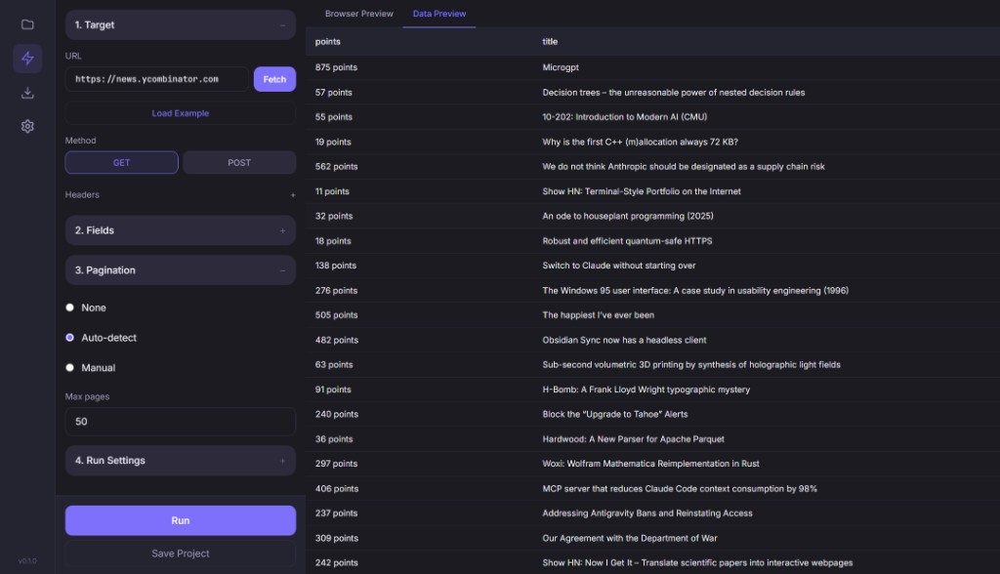

# Spider Studio

A desktop web scraping app built with Tauri 2.0 + React + Python.

## Features

- **Visual config** — Configure targets, fields, and selectors visually
- **Selector validation** — Test and validate CSS selectors before scraping
- **Browser preview** — See page screenshots and inspect elements
- **Pagination** — Auto-detect or manual pagination support
- **Real-time preview** — Live data preview as scraping runs
- **CSV / XLSX / JSON export** — Export scraped data in multiple formats
- **Project management** — Save, load, and organize scraping projects
- **Scheduled scraping** — Run scrapes on a schedule (hourly, daily, weekly)
- **Run history** — Track past runs and row counts
- **Data comparison** — Compare runs to see what changed
- **Light / dark theme** — Choose your preferred appearance

## Tech Stack

- **Tauri 2.0** — Desktop shell and native APIs
- **React** — UI framework
- **TypeScript** — Type safety
- **Tailwind CSS** — Styling
- **Framer Motion** — Animations
- **Python** — Scraping engine
- **Playwright** — Browser automation
- **Pandas** — Data processing
- **SQLite** — Projects, exports, and settings storage

## Getting Started

### Prerequisites

- **Node.js** 18+
- **Rust** (for Tauri)
- **Python 3.8+**

### Running the installed app (Windows)

After installing Spider Studio via the `.msi` or `.exe` installer, you must have **Python** and **Playwright** set up for scraping and browser preview to work:

```bash
# Install Python dependencies (required for scraping)
pip install playwright pandas openpyxl

# Install Chromium browser (required for browser preview and scraping)
playwright install chromium
```

Ensure `python` is available on your system PATH.

### Development setup

```bash
# Install frontend dependencies
npm install

# Install Python dependencies (required for scraping)
pip install playwright pandas openpyxl

# Install Playwright browser
playwright install chromium
```

### Development

```bash
npm run tauri dev
```

### Build

```bash
npm run tauri build
```

## Screenshots



## License

MIT
